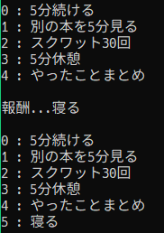

# ゲーミフィケーションの報酬管理プログラム DiceAward

## 概要

- ゲーミフィケーションで根幹となる，報酬を管理，操作するプログラムです．
- コマンドライン引数で，本プログラムが提供する機能を使うことができます．
- 報酬はすべて**src/award/award.txt**にあり，このファイルを操作します．

## 提供する機能

1. ランダムに報酬を表示する
2. 報酬を追加する
3. 指定した報酬を上書きする
4. 指定した報酬を削除する
5. すべての報酬を表示する

### ランダムに報酬を表示する

- この機能は，**src/award/award.txt** に記述している報酬からランダムに出力する機能です．コマンドライン引数無しで実行します．  
- 実行方法は以下のようになります．

```
java app.Main
```

### 報酬を追加する

- この機能は，**src/award/award.txt** に報酬を追記する機能です．追加すると，その結果が出力されます．  
- コマンドライン引数には，**add**を渡します．
- 実行方法は以下のようになります．

```
java app.Main add
```

- 実行結果は以下のようになります．「寝る」と報酬を追加しています．  

&emsp;

### 指定した報酬を上書きする

- この機能は，**src/award/award.txt**に記述している報酬を指定して，上書きします．
- コマンドライン引数には，**set**を渡します．
- 実行方法は以下のようになります．

```
java app.Main set
```

- 実行結果は以下のようになります．「寝る」という報酬を「5分寝る」に変更しています．

&emsp;

### 指定した報酬を削除する

- この機能は，**src/award/award.txt**に記述している報酬を指定して，削除します．
- コマンドライン引数には，**remove**を渡します．
- 実行方法は以下のようになります．

```
java app.Main remove
```

- 実行結果は以下のようになります．「5分寝る」という報酬を削除しています．

&emsp;

### すべての報酬を表示する

- この機能は，**src/award/award.txt**に記述している報酬を表示します．
- コマンドライン引数には，**show**を渡します．
- 実行方法は以下のようになります．

```
java app.Main show
```

- 実行結果は以下のようになります．

&emsp;
